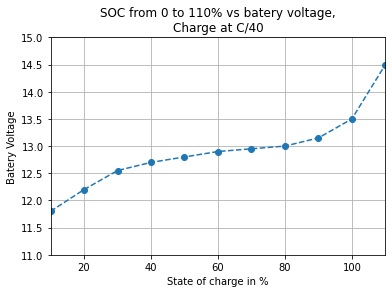
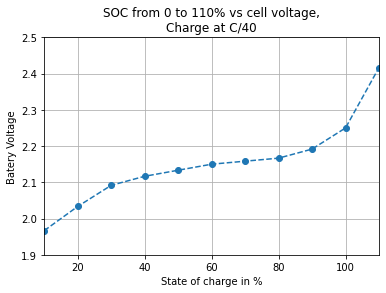
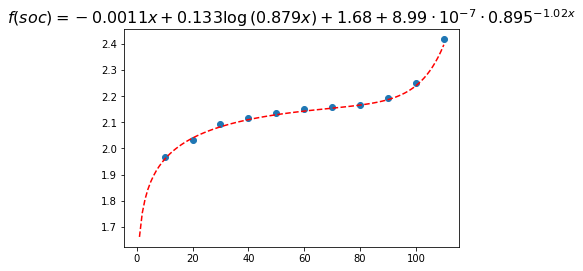
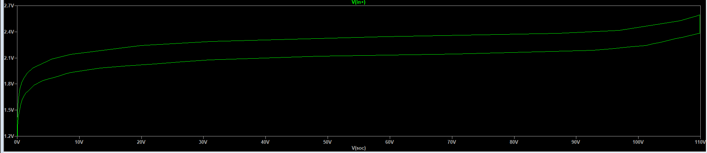
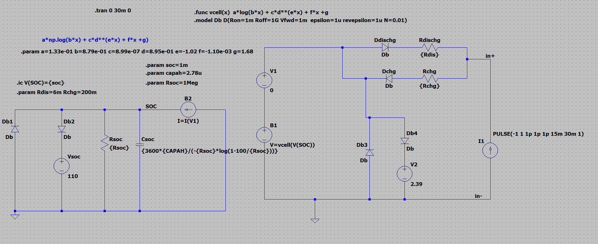

# Batery model for lead acid
## Goals
Do:
* charge model
* discharge model
* Scalable from 1 to 12 cells
* Quick simulation
* No discontinuity in function and derivative (no linear interpolation)
* LT spice simulation

Don't:
* real life acurate
* Time consistant
* Temperature dependancy will not be taken in account
* no general spice simulation planed
## Model construction
This model is based on shifting a simple charge curve at C/40 taken from [Lead-Acid Battery State of Charge vs. Voltage](./assets/pdf/lead_acid_battery_charging_graphs.pdf).
Those values are from a 12V lead acid batery, divided by six they give a raw aproximation for one cell.

Here is a graph from pdf values:

</img>

From this data divided by six:

From this a model is derived. Choosen function  is a combination of logaritmic, exponential approximation, central function is linear.
$$  a.ln(b.x) + c.d^{e.x} + fx +g $$

Curve fiting results:
* a=1.33039653e-01
* b=8.79300846e-01
* c=8.98882529e-07
* d=8.94791624e-01
* e=-1.02358080e+00
* f=-1.10149442e-03
* g=1.68465288e+00

Restricting values to significan digits:

* a=1.33e-01
* b= 8.79e-01
* c=8.99e-07
* d=8.95e-01 
* e=-1.02
* f=-1.10e-03
* g=1.68

Model fitting plot:

</img>

Model function error:
* max error is: 0.8683%
* min error is: 0.0617%
* mean error is: 0.3644%

For our purposes 1% error is aceptable.
See [1 cell notebook](./model.ipynb.py) for more details.

## Implemetation in LT spice is realised by:
* clamps with `ideal diodes`
* 1 Meg paralled resistor minimal current for charging:
$$
I_{chg}=\frac{100}{R} = 100 uA
$$
* Capacitor value for corresponding batery capacity or quick simulation in this case. Operation: 
$$
C = \frac{3600.C_{AH}}{-R.\ln(1-\dfrac{100}{R})}
$$
For ~10ms full charge at 1A C=~100uF

See [RC parallel](./RC_parallel.ipynb) notebook for details.

## Model simulation
LTspice simulation for 1 cell: [1 cell model ](./1cell_model.asc).
Results:

Not acurate for a real life model but good enought for a raw simulation.
Here is the circuit:

