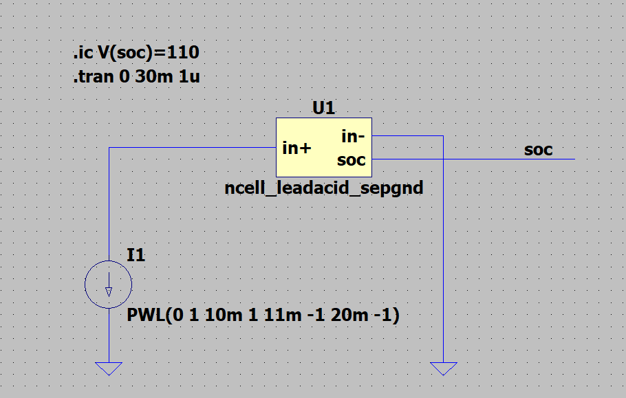
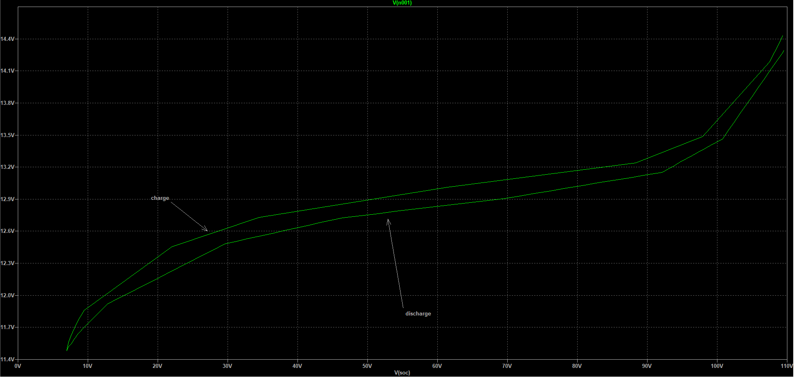
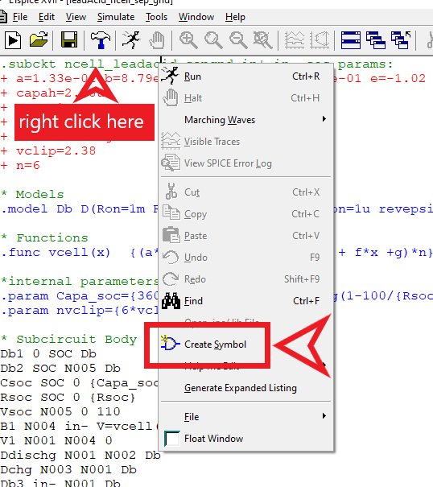
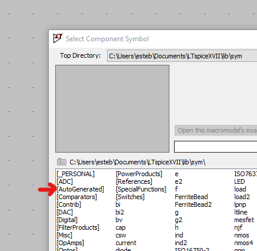

# Battery model for lead acid
## Goals
Do:
* State of charge based model
* Charge **and** Discharge capable
* Scalable to n cells
* Quick simulation
* No discontinuity in function and derivative (no linear interpolation:
helps a lot when simulating complex circuits)
* LT spice simulation and .lib

Don't:
* Real life acurate
* Time consistant
* Temperature dependancy will not be taken in account
* no general spice simulation planed

## Model construction
This model is based on shifting a simple charge curve at C/40 taken from [Lead-Acid Battery State of Charge vs. Voltage](./assets/pdf/lead_acid_battery_charging_graphs.pdf).
Those values are from a 12V lead acid battery, divided by six they give a raw aproximation for one cell.

Here is a graph from pdf values:

</img>

From this data divided by six:


From this a model is derived. Choosen function  is a combination of logaritmic, exponential approximation, central function is linear.
$$  a.ln(b.x) + c.d^{e.x} + fx +g $$

Curve fiting results:
* a=1.33039653e-01
* b=8.79300846e-01
* c=8.98882529e-07
* d=8.94791624e-01
* e=-1.02358080e+00
* f=-1.10149442e-03
* g=1.68465288e+00

Restricting values to significan digits:

* a=1.33e-01
* b= 8.79e-01
* c=8.99e-07
* d=8.95e-01 
* e=-1.02
* f=-1.10e-03
* g=1.68

Model fitting plot:

</img>

Model function error:
* max error is: 0.8683%
* min error is: 0.0617%
* mean error is: 0.3644%

For our purposes 1% error is aceptable.
See [1 cell notebook](./notebooks/model.ipynb) for more details.

## Implemetation in LT spice is realised by:
* clamps with `ideal diodes`
* 1 Meg paralled resistor minimal current for charging:
$$
I_{chg}=\frac{100}{R} = 100 uA
$$
* Capacitor value for corresponding battery capacity or quick simulation in this case. Operation: 
$$
C = \frac{3600.C_{AH}}{-R.\ln(1-\dfrac{100}{R})}
$$
For ~10ms full charge at 1A C=~100uF

See [RC parallel](./RC_parallel.ipynb) notebook for details.

## Model simulation
LTspice simulation for 1 cell: [1 cell model ](./simulations/1cell_model.asc).
Results:


Not acurate for a real life model but good enough 
when both charge and discharge needs to be simulated.

Here is the circuit:


## LTspice model lib

### 1 cell model 

[model file](./models/leadAcid_1cell_sep_gnd.lib)

``` spice
.subckt 1cell_leadacid_sepgnd in+ in- soc params:
+ a=1.33e-01 b=8.79e-01 c=8.99e-07 d=8.95e-01 e=-1.02 f=-1.10e-03 g=1.68
+ capah=2.78u
+ Rsoc=1Meg
+ soc=80
+ Rdis=6m Rchg=200m

* Models
.model Db D(Ron=1m Roff=1G Vfwd=1m  epsilon=1u revepsilon=1u N=0.001)

* Functions
.func vcell(x)  a*log(b*x) + c*d**(e*x) + f*x +g

*internal parameters
.param Capa_soc={3600*{CAPAH}/(-{Rsoc}*log(1-100/{Rsoc}))}

* Subcircuit Body
Db1 0 SOC Db
Db2 SOC N005 Db
Csoc SOC 0 {Capa_soc}
Rsoc SOC 0 {Rsoc}
Vsoc N005 0 110
B1 N004 in- V=vcell(V(SOC))
V1 N001 N004 0
Ddischg N001 N002 Db
Dchg N003 N001 Db
Db3 in- N001 Db
Rdischg in+ N002 {Rdis}
Rchg in+ N003 {Rchg}
Db4 N001 N006 Db
Voverchg N006 in- 2.38
B2 0 SOC I=I(V1)
.ends 1cell_leadacid_sepgnd
```

### n cell model

See [n cells model](./models/leadAcid_ncell_sep_gnd.lib) for n cell model.

```spice
.subckt ncell_leadacid_sepgnd in+ in- soc params:
+ a=1.33e-01 b=8.79e-01 c=8.99e-07 d=8.95e-01 e=-1.02 f=-1.10e-03 g=1.68
+ capah=2.78u
+ Rsoc=1Meg
+ soc=80
+ Rdis=6m Rchg=200m
+ vclip=2.38
+ n=6 

* Models
.model Db D(Ron=1m Roff=1G Vfwd=1m  epsilon=1u revepsilon=1u N=0.001)

* Functions
.func vcell(x)  {(a*log(b*x) + c*d**(e*x) + f*x +g)*n}

*internal parameters
.param Capa_soc={3600*{CAPAH}/(-{Rsoc}*log(1-100/{Rsoc}))}
.param nvclip={6*vclip}

* Subcircuit Body
Db1 0 SOC Db
Db2 SOC N005 Db
Csoc SOC 0 {Capa_soc}
Rsoc SOC 0 {Rsoc}
Vsoc N005 0 110
B1 N004 in- V=vcell(V(SOC))
V1 N001 N004 0
Ddischg N001 N002 Db
Dchg N003 N001 Db
Db3 in- N001 Db
Rdischg in+ N002 {Rdis}
Rchg in+ N003 {Rchg}
Db4 N001 N006 Db
Voverchg N006 in- {nvclip}
B2 0 SOC I=I(V1)
.ends ncell_leadacid_sepgnd
```



Simulation results for 6 cells (12V battery):



Also in pdf format:
[simulation results 6 cells pdf](./assets/img/6cell_model_results.pdf)


### model tuning
To adapt the model to your needs change:
- Discharge resistor **Rdis** 
- Charge resistor **Rchg**
- 1 cell voltage clip **vclip**
- number of cells **n**

### How to use

Just open "./models/leadAcid_ncell_sep_gnd.lib" file with LTspice.
Right clic on model name and click on create symbol.



the new symbol will be added to your library under `AutoGenerated` folder.



### Model notes 

- `in-` pin needs to have a ground reference if you chain 1cells the last must have `in-` connected to ground
- initial soc need to be provided eg `.ic V(soc)=100` for a 100% charge initial state
- `soc` pin voltage gives the battery charge %. 100 Volts (gnd ref)= 100%
- Overcharge to 110% is posible
- Try not to go under 10% charge since no real data has been taken bellow this threshold


